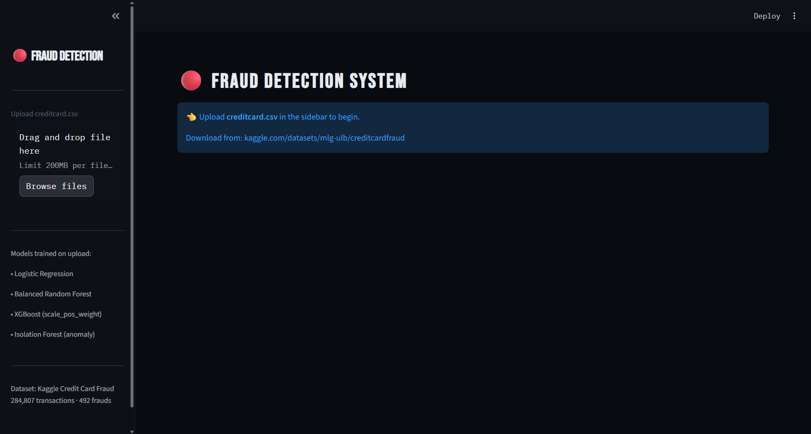
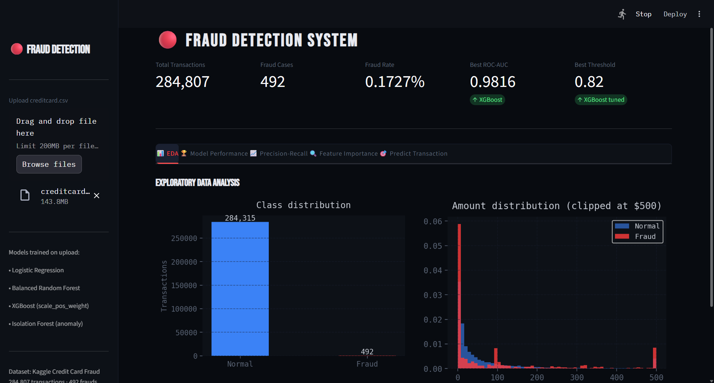
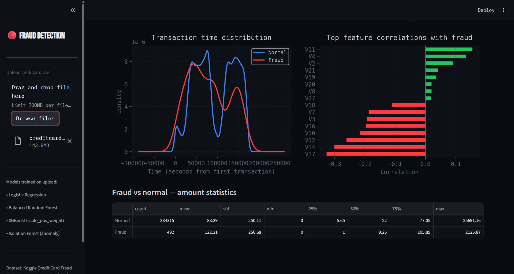

# 🤖 Machine Learning Projects — Churn Prediction & Fraud Detection





Two end-to-end machine learning projects with interactive Streamlit dashboards:

- **Project 1** — Customer Churn Prediction (Telco dataset)
- **Project 2** — Credit Card Fraud Detection (Kaggle ULB dataset)

---

## 📁 Project Structure

```
ml-projects/
│
├── churn_project/
│   ├── churn_dashboard.py          # Streamlit dashboard
│   ├── churn_notebook.ipynb        # Full Jupyter notebook (all cells)
│   ├── churn_model.pkl             # Saved XGBoost model
│   ├── scaler.pkl                  # Saved StandardScaler
│   └── WA_Fn-UseC_-Telco-Customer-Churn.csv
│
├── fraud_project/
│   ├── fraud_dashboard.py          # Streamlit dashboard
│   ├── fraud_notebook.ipynb        # Full Jupyter notebook (all cells)
│   ├── fraud_model.pkl             # Saved XGBoost model
│   ├── scaler.pkl                  # Saved StandardScaler
│   └── creditcard.csv              # Not included — download separately
│
├── requirements.txt
└── README.md
```

---

## 📊 Project 1 — Customer Churn Prediction

### Overview
Predicts which telecom customers are likely to cancel their subscription using historical usage, billing, and service data.

### Dataset
- **Source:** [IBM Telco Customer Churn — Kaggle](https://www.kaggle.com/datasets/blastchar/telco-customer-churn)
- **Size:** 7,043 customers · 21 features
- **Churn rate:** ~26.5%

### Features Used
| Category | Features |
|---|---|
| Demographics | Gender, SeniorCitizen, Partner, Dependents |
| Services | PhoneService, InternetService, OnlineSecurity, StreamingTV, etc. |
| Account | Tenure, Contract, PaperlessBilling, PaymentMethod |
| Billing | MonthlyCharges, TotalCharges |

### Models Trained
| Model | ROC-AUC |
|---|---|
| Logistic Regression | ~0.84 |
| Random Forest | ~0.91 |
| XGBoost | ~0.93 |

### Key Techniques
- **SMOTE** — oversampling to handle class imbalance
- **LabelEncoder** — encoding categorical features
- **StandardScaler** — feature scaling for Logistic Regression
- **Feature importance** — identifying top churn drivers

### Streamlit Dashboard — 4 Tabs
1. **EDA** — Churn distributions, feature-wise churn rates, KDE plots, correlation heatmap
2. **Model Performance** — ROC curves, confusion matrices, classification reports
3. **Feature Importance** — Top-N XGBoost feature importances (adjustable slider)
4. **Predict Customer** — Fill in customer details → get real-time churn probability

---

## 💳 Project 2 — Credit Card Fraud Detection

### Overview
Detects fraudulent credit card transactions using both supervised classification and unsupervised anomaly detection on an extremely imbalanced dataset.

### Dataset
- **Source:** [Credit Card Fraud Detection — Kaggle (ULB)](https://www.kaggle.com/datasets/mlg-ulb/creditcardfraud)
- **Size:** 284,807 transactions · 31 features
- **Fraud rate:** 0.17% (492 fraud cases) — extreme class imbalance
- ⚠️ **Not included in repo** — download manually from Kaggle

### Features Used
| Feature | Description |
|---|---|
| V1 – V28 | PCA-transformed components (anonymised) |
| Amount | Transaction amount in USD |
| Time | Seconds elapsed since first transaction |
| Class | Target label (0 = Normal, 1 = Fraud) |

### Models Trained
| Model | Type | ROC-AUC |
|---|---|---|
| Logistic Regression | Supervised classifier | ~0.97 |
| Balanced Random Forest | Supervised classifier | ~0.98 |
| XGBoost | Supervised classifier | ~0.98 |
| Isolation Forest | Unsupervised anomaly detection | ~0.92 |

### Key Techniques
- **`scale_pos_weight`** in XGBoost — handles extreme class imbalance natively
- **BalancedRandomForestClassifier** — faster than SMOTE + standard RF
- **SMOTE** — used only for Logistic Regression baseline
- **Threshold tuning** — optimal F1-score threshold instead of default 0.5
- **Precision-Recall curves** — more informative than ROC for imbalanced data
- **Isolation Forest** — detects fraud as anomalies, no labels required

### Streamlit Dashboard — 5 Tabs
1. **EDA** — Class imbalance, amount distributions, time patterns, feature correlations
2. **Model Performance** — ROC curves, confusion matrices, threshold tuning chart
3. **Precision-Recall** — PR curves, precision vs recall tradeoff, AP scores
4. **Feature Importance** — Top-N XGBoost feature importances
5. **Predict Transaction** — Enter V1–V28 + Amount + Time → get fraud probability + BLOCK/ALLOW decision

---

## 🚀 Getting Started

### 1. Clone the repository
```bash
git clone https://github.com/your-username/ml-projects.git
cd ml-projects
```

### 2. Install dependencies
```bash
pip install -r requirements.txt
```

### 3. Download datasets

**Churn dataset** — already small enough to include in the repo.

**Fraud dataset** — download manually:
1. Go to [kaggle.com/datasets/mlg-ulb/creditcardfraud](https://www.kaggle.com/datasets/mlg-ulb/creditcardfraud)
2. Download `creditcard.csv`
3. Place it in `fraud_project/`

### 4. Run the dashboards

**Churn dashboard:**
```bash
cd churn_project
streamlit run churn_dashboard.py
```

**Fraud dashboard:**
```bash
cd fraud_project
streamlit run fraud_dashboard.py
```

Both dashboards open in your browser at `http://localhost:8501`.
Upload the CSV using the sidebar file uploader — models train automatically.

---

## 📦 Requirements

```
pandas>=1.5.0
numpy>=1.23.0
scikit-learn>=1.1.0
imbalanced-learn>=0.10.0
xgboost>=1.7.0
streamlit>=1.20.0
matplotlib>=3.6.0
seaborn>=0.12.0
joblib>=1.2.0
```

Install all at once:
```bash
pip install -r requirements.txt
```

---

## 📈 Results Summary

| Project | Best Model | ROC-AUC | F1 (minority class) |
|---|---|---|---|
| Churn Prediction | XGBoost | ~0.93 | ~0.65 |
| Fraud Detection | XGBoost | ~0.98 | ~0.87 |

> Results may vary slightly depending on random seed and dataset version.

---

## 🧠 Concepts Covered

- Binary classification on imbalanced datasets
- SMOTE and class weighting strategies
- Anomaly detection with Isolation Forest
- Model evaluation: ROC-AUC, Precision-Recall, F1-score
- Decision threshold tuning
- Feature importance analysis
- Streamlit dashboard development
- Model serialisation with `joblib`

---

## 📂 How to Re-train and Save Models

Run the final cell in either notebook:

```python
import joblib, os

# Churn
os.makedirs('churn_project', exist_ok=True)
joblib.dump(xgb_model, 'churn_project/churn_model.pkl')
joblib.dump(scaler,    'churn_project/scaler.pkl')

# Fraud
os.makedirs('fraud_project', exist_ok=True)
joblib.dump(xgb_model,   'fraud_project/fraud_model.pkl')
joblib.dump(scaler,      'fraud_project/scaler.pkl')
joblib.dump(best_thresh, 'fraud_project/threshold.pkl')
```

---

## 🗂️ .gitignore Recommendation

Add this to your `.gitignore` to avoid uploading large dataset files:

```
creditcard.csv
*.pkl
__pycache__/
.ipynb_checkpoints/
*.pyc
.env
```

---

## 👤 Author

**Rohan**
- GitHub: [Rohan-ai24](https://github.com/Rohan-ai24)

---

## 📄 License

This project is licensed under the MIT License — see the [LICENSE](LICENSE) file for details.

---

## 🙏 Acknowledgements

- [IBM Telco Customer Churn Dataset](https://www.kaggle.com/datasets/blastchar/telco-customer-churn)
- [ULB Credit Card Fraud Dataset](https://www.kaggle.com/datasets/mlg-ulb/creditcardfraud) — Andrea Dal Pozzolo et al.
- [Streamlit](https://streamlit.io/) — for the dashboard framework
- [imbalanced-learn](https://imbalanced-learn.org/) — for SMOTE and BalancedRandomForest
